# Gym_application

Workout tracking app built with .NET MAUI for iOS. The application helps users manage training sessions, track progress, log notes, and monitor body weight over time. It includes workout timers, set tracking, customizable training programs, and performance analytics. Designed as a clean and focused tool for consistent gym progress.

```mermaid
classDiagram

    class WorkoutViewModel {
        -INavigationService _navigation
        +ObservableCollection~WorkoutHistory~ WorkoutHistory
        +ObservableCollection~WorkoutPrograms~ WorkoutPrograms
        +ICommand OpenWorkoutCommand
        +ICommand OpenCreateWorkoutCommand
        +WorkoutViewModel(INavigationService navigation)
        +UpdateWorkouts() Task
        +OnPropertyChanged(string propertyName) void
    }

    class CreateWorkoutViewModel {
        -INavigationService _navigation
        -ExerciseAPIService _apiService
        -List~string~ _exercisesList
        +ObservableCollection~Exercise~ ExerciseSuggestion
        +ICommand CreateCommand
        +ICommand FindCommand
        +ICommand SelectExerciseCommand
        +ICommand AddExerciseCommand
        +string WorkoutTitle
        +string ExerciseEntry
        +bool IsDropDownVisible
        +Exercise SelectedExercise
        +string SelectedNumberOfSets
        +string SelectedNumberOfReps
        +string SelectedWeight
        +string SelectedRest
        +string SelectedWarmUp
        +string SelectedCoolDown
        +string SelectedWorkoutType
        +CreateWorkoutViewModel(INavigationService navigation, ExerciseAPIService apiService)
        +GetExercises() Task
        -CreateExercise() Task
        -CreateWorkout() Task
        +OnPropertyChanged(string propertyName) void
    }

    class WorkoutDetailsViewModel {
        +WorkoutPrograms SelectedWorkout
        +ICommand SaveCommand
        +ICommand DeleteCommand
        +WorkoutDetailsViewModel(WorkoutPrograms workoutPrograms)
        -SaveAsync() Task
        -DeleteAsync() Task
        +OnPropertyChanged(string propertyName) void
    }

    class JournalViewModel {
        -INavigationService _navigation
        +ObservableCollection~Notes~ Notes
        +ICommand OpenCreateNoteCommand
        +ICommand OpenNoteCommand
        +JournalViewModel(INavigationService navigation)
        +UpdateNotes() Task
        +OnPropertyChanged(string propertyName) void
    }

    class CreateNoteViewModel {
        +string NoteText
        +string NoteTitle
        +ICommand SaveCommand
        +CreateNoteViewModel()
        -SaveNoteAsync() Task
        +OnPropertyChanged(string propertyName) void
    }

    class NoteDeatailsViewModel {
        +Notes SelectedNote
        +ICommand SaveCommand
        +ICommand DeleteCommand
        +NoteDeatailsViewModel(Notes note)
        -SaveAsync() Task
        -DeleteAsync() Task
        +OnPropertyChanged(string propertyName) void
    }

    class INavigationService {
        +GoToAsync(string pageName) Task
        +OpenWorkoutDetailsAsync(WorkoutPrograms workout) Task
        +OpenNoteDetailsAsync(Notes note) Task
    }

    class ExerciseAPIService {
        +GetExerciseAsync(string exercise) Task
    }

    class DatabaseService {
        +SaveWorkoutProgramsAsync(WorkoutPrograms workout) Task
        +SaveWorkoutExercisesAsync(WorkoutExercises exercise) Task
        +SaveWorkoutSessionAsync(WorkoutSession session) Task
        +GetWorkoutSessionsAsync() Task
        +GetExercisesIdAsync(List~string~ exercises) Task
        +GetWorkoutIdAsync(string title) Task
        +SaveAsync(Notes note) Task
        +GetNotesAsync() Task
        +DeleteNoteAsync(Notes note) Task
        +DeleteWorkoutProgramAsync(WorkoutPrograms workout) Task
    }

    class WorkoutPrograms
    class WorkoutExercises
    class WorkoutSession
    class WorkoutHistory
    class Notes

    WorkoutViewModel --> INavigationService
    WorkoutViewModel --> WorkoutPrograms
    WorkoutViewModel --> WorkoutHistory
    WorkoutViewModel --> DatabaseService

    CreateWorkoutViewModel --> INavigationService
    CreateWorkoutViewModel --> ExerciseAPIService
    CreateWorkoutViewModel --> WorkoutPrograms
    CreateWorkoutViewModel --> WorkoutExercises
    CreateWorkoutViewModel --> WorkoutSession
    CreateWorkoutViewModel --> DatabaseService

    WorkoutDetailsViewModel --> WorkoutPrograms
    WorkoutDetailsViewModel --> DatabaseService

    JournalViewModel --> INavigationService
    JournalViewModel --> Notes
    JournalViewModel --> DatabaseService

    CreateNoteViewModel --> Notes
    CreateNoteViewModel --> DatabaseService

    NoteDeatailsViewModel --> Notes
    NoteDeatailsViewModel --> DatabaseService
```

